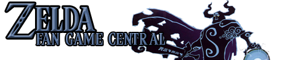

# ZFGBB Backend

A modern BBS software for the ZFGC community, written in Java.

Bringin back the Drama Llama from the dead! If you are looking for the frontend, where the drama llama roams, please visit <https://github.com/ZFGCCP/ZFGCBB-React>.

## Table of Contents

- [ZFGBB Backend](#zfgbb-backend)
  - [Table of Contents](#table-of-contents)
  - [Getting Started](#getting-started)
  - [License](#license)
  - [Contributing](#contributing)
  - [CI Status](#ci-status)
    - [Workflow - Frontend - CI](#workflow---frontend---ci)
    - [Workflow - Backend - CI](#workflow---backend---ci)

## Getting Started

Read the [CONTRIBUTING.md](CONTRIBUTING.md) file for details on how to setup the development environment!

## License

This project is licensed under the [BSD 3-Clause License](LICENSE).

## Contributing

Please read [CONTRIBUTING.md](CONTRIBUTING.md) for details on our code of conduct, and the process for submitting pull requests to us.

## CI Status

### Workflow - Frontend - CI

### Workflow - Backend - CI

